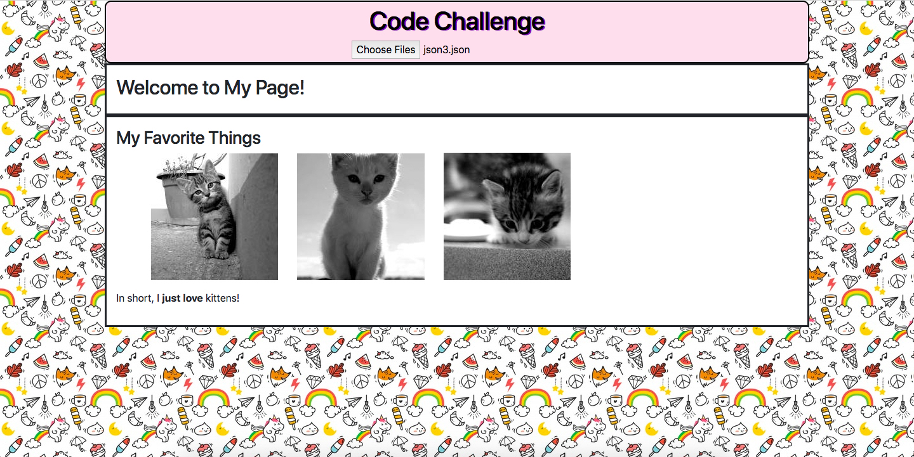

# JSON to HTML

*[Justin Hays](https://github.com/just-hey "Justin Hays' GitHub")*

### What it can do:
JSON to HTML does exactly what you might think.  It brings pure joy to those that take the time to look at it in all it's glory.  J.H., as I'm now calling it (it calls me J.H. too so it's only fair. TWINZIES!!!), may take a user selected .json file that follows a certain syntax but is arbitrarily nested. When that file is loaded, the generated HTML is based on the nested structure and displays said HTML on the page with a totes adorbz wallpaper in the background.

### But why?

Because I'm trying to give you the ol' razzle dazzle.

### Deployed here: http://json-to-html.surge.sh/

### Features
- Converts JSON to HTML

### Technologies
- JavaScript
- File APIs (to read files in JavaScript)
- HTML
- CSS
- bootstrap

### Screenshot

